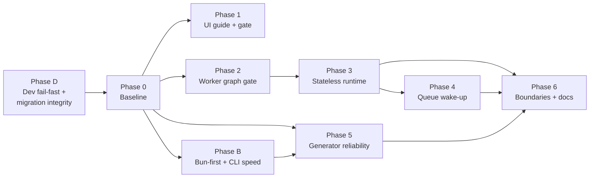
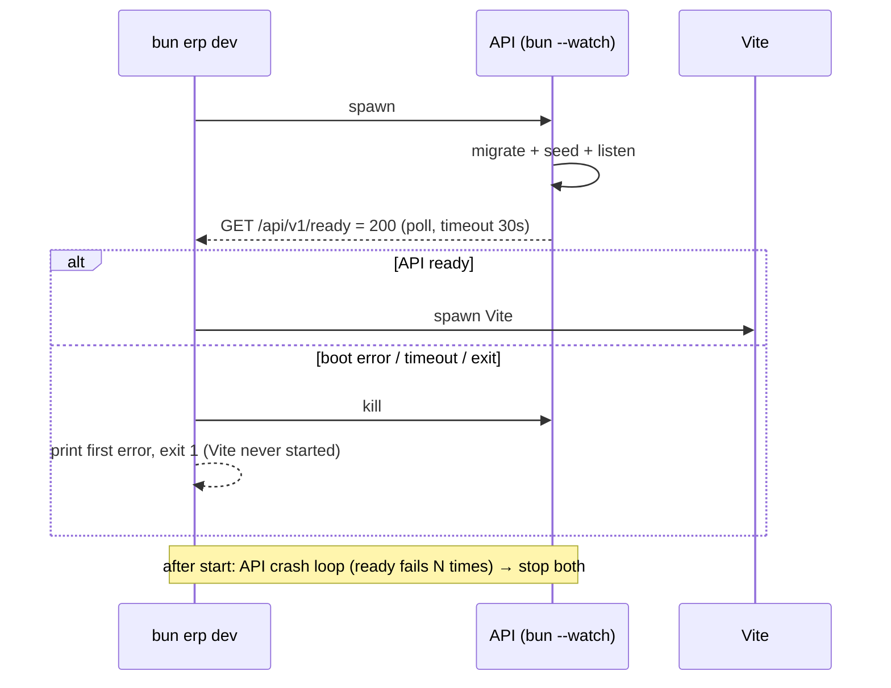
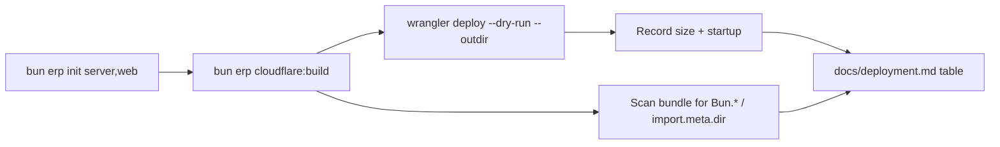
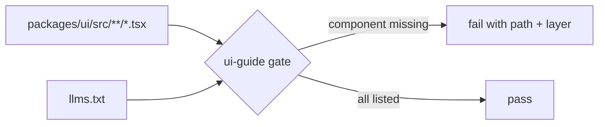
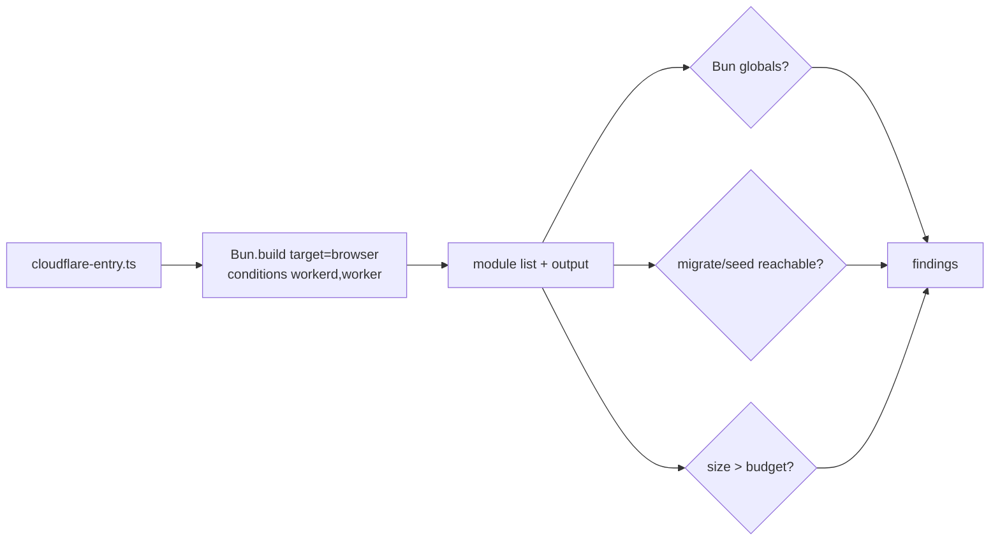
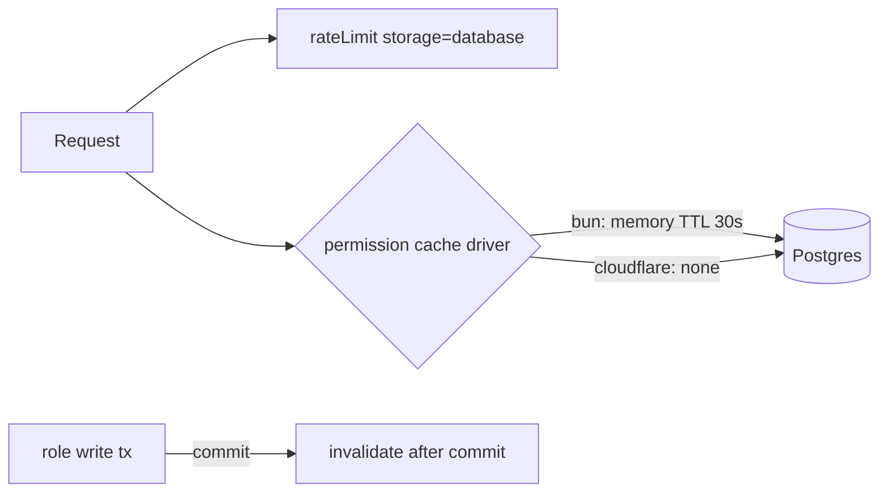
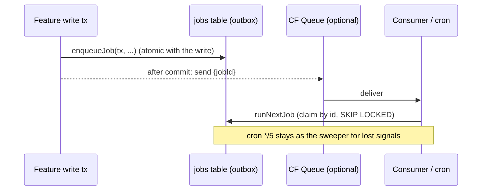
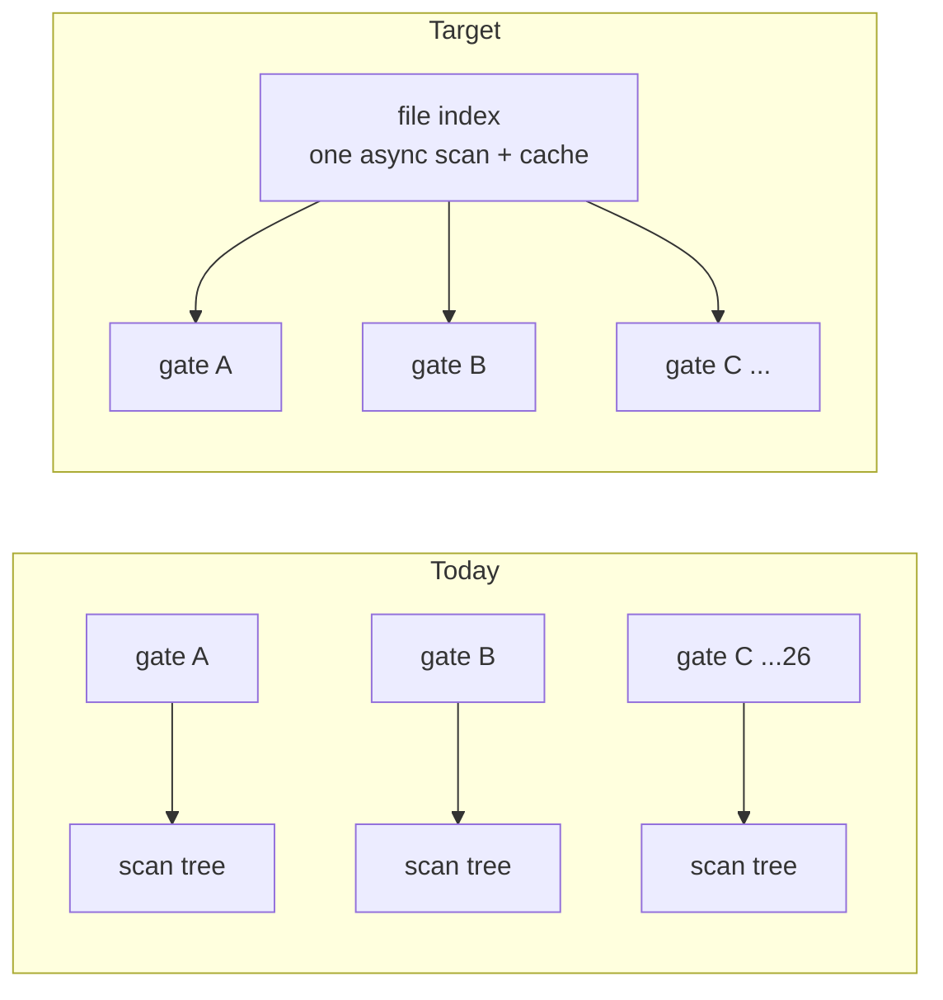
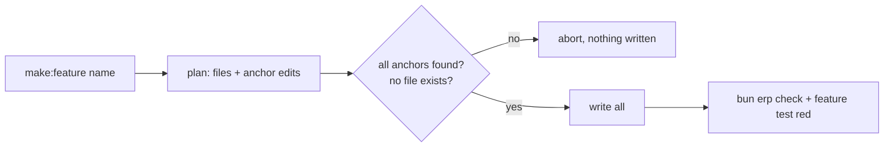
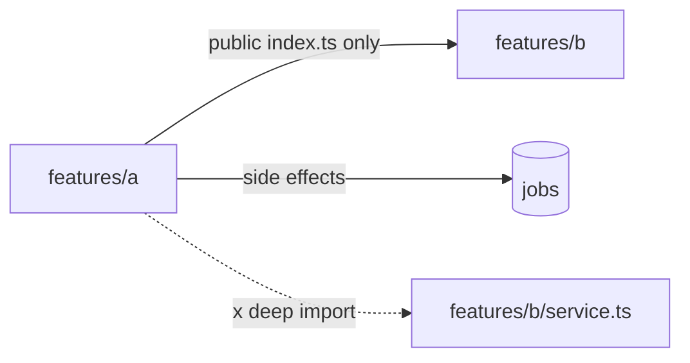

> Living plan. Human-owned status: an agent leaves this at `in_progress` with real evidence and
> never raises it to `ready` or `done` itself. Source backlog: F3.2 "Goal gaps".

# F3.3 — Goal alignment

## Goal

Make the template provably meet its three goals instead of only documenting them:

1. **Pattern library for agents.** Every `packages/ui` component is discoverable in `llms.txt`, and a
   gate keeps it that way. Agents copy patterns instead of improvising.
2. **Semi-monolith, microservice-ready, Laravel-level productivity.** No per-process state acts as a source of
   truth. Side effects go through the durable queue, feature boundaries are explicit, and generators
   never leave a half-wired feature.
3. **Fits Cloudflare Workers Free within stated limits.** A gate proves the Worker graph has no Bun-only
   code, no DDL/seed, and stays inside a measured size/startup budget.

## Platform facts (Context7, 2026-10-07)

| Fact | Value | Consequence |
|---|---|---|
| Workers Free CPU | 10 ms per invocation | `wrangler.jsonc` already sets `cpu_ms: 10`; scrypt sign-in is the known risk |
| Worker size | 64 MiB **uncompressed**, all plans; the 3 MB compressed Free limit was removed | Size is no longer the blocker. Startup time and CPU are. Budget against startup, not gzip |
| Free subrequests | 50 external / 1,000 Cloudflare-service per invocation | N+1 and fan-out per request matter |
| Better Auth rate limit | `rateLimit.storage: "database"` + `rateLimit` table (`key` unique, `count`, `lastRequest` bigint) | Fixes the per-isolate limiter without new infrastructure |
| Queues | Free plan includes Queues (**verify** the exact quota in the dashboard before Phase 4) | Phase 4 has a fallback that needs no Queues |

**(verify)** Worker startup (global scope) limit and whether Hyperdrive queries count toward the
subrequest limit. Phase 0 records both from the current docs.

## Execution model

- **Wave 0 (first, blocking):** Phase D. It breaks local development today.
- **Wave A (parallel):** Phase 1, Phase 2, Phase B. Phase 5 starts after Phase B merges, because both
  touch `cli/lib/**`. Run each in its own `git worktree` with its own
  `bun erp init --apps server,web --yes` install. File ownership is disjoint.
- **Wave B (serial):** Phase 3, then Phase 4.
- **Wave C:** Phase 6.
- Every phase follows TDD red→green, keeps `bun run lint` + `bun erp check` + `bun erp test` green inside
  its worktree, and reports evidence to the integrator, who appends it here.
- No phase adds a runtime dependency except where stated.

## Migration numbering (pre-assigned)

The server catalog ends at `0010_import_export`.

| Phase | Migration |
|---|---|
| 3 Stateless runtime | `0011_rate_limit.ts` |

## File ownership (parallel contract)

| Phase | Owns | Must not touch |
|---|---|---|
| D Dev fail-fast | `templates/apps/server/{cli/tasks/dev.ts,cli/lib/development-environment.ts,database/migrate.ts,bootstrap/server.ts,cli/commands/db.ts}`, `templates/apps/server/tests/features/database/**` | `cli/gates/**` |
| 0 Baseline | `docs/deployment.md` (measurements section only) | code |
| B Bun-first | `cli/gates/**` (except `ui-guide.ts`, `worker-graph.ts`), `cli/lib/{repo,registry-cache,file-index}.ts`, `cli/registry.ts`, `cli/tasks/**`, `cli/gates/bun-first.ts` + test, `docs/conventions.md` (Bun-first section) | `cli/commands/make.ts`, `cli/lib/scaffolding.ts`, `templates/apps/**` runtime code |
| 1 UI guide | `packages/ui/llms.txt`, `skills/ui-registry/**`, `cli/gates/ui-guide.ts`, its test, `cli/lib/gates.ts` catalog row, `docs/gates.md` row | `packages/ui/src/**` (except adding a JSDoc purpose line) |
| 2 Worker graph | `cli/gates/worker-graph.ts`, its test, `cli/lib/gates.ts` catalog row, `docs/gates.md` row, `templates/apps/server/bootstrap/{worker,cloudflare-*}.ts` | `templates/apps/server/features/**` |
| 3 Stateless | `templates/apps/server/{features/identity/auth.ts,features/rbac/{cache,service}.ts,features/identity/service.ts,config/**,database/migrations/0011_*}`, server tests | `cli/**` |
| 4 Queue wake-up | `templates/apps/server/infra/jobs/**`, `bootstrap/worker.ts`, `wrangler.jsonc`, `docs/deployment.md` jobs section | `features/**` except `features/jobs.ts` |
| 5 Generators | `cli/commands/make.ts`, `cli/commands/features.ts`, `cli/lib/scaffolding.ts`, `cli/lib/infra-wiring.ts`, `templates/generators/**` (new) | `templates/apps/**` runtime code |
| 6 Boundaries | `cli/gates/architecture-guard.ts`, `docs/architecture.md`, `templates/apps/server/http/app.ts` | — |

---

## Phase D — Dev fail-fast and migration integrity (blocking)

### Incident (2026-10-07, `bun erp dev` on a long-lived local DB)

- The API crashed at boot in `seed()`. The roles upsert used `ON CONFLICT ("key")`, and Postgres answered
  `42P10 there is no unique or exclusion constraint matching the ON CONFLICT specification`.
- Vite kept serving `http://localhost:5173`, and every `/api/*` call failed. Expected behaviour: if the
  backend cannot boot, `bun erp dev` exits non-zero and the web app does not start.

**Root cause 1: the ledger silently skipped migrations.** `migrationId()` (`S/database/migrate.ts:34`)
compares only the 4-digit prefix. The local DB was created by the old tenant-era catalog
(`0001_organizations.sql`, `0003_auth.sql`, `0004_rbac.sql`, `0007_background_jobs.ts`,
`0008_create_smoke_widgets_table.ts`). The current `0003_rbac.ts`, `0007_notifications.ts` and
`0008_scheduler.ts` were treated as applied:

- `roles` still has only `unique (organization_id, key)` and no `unique (key)`, which caused the crash.
- The tables `notifications` and `job_schedules` do not exist. Checked with `to_regclass`, both return null.

This is the F3.2 P1 "duplicate numbers silently skip" item, now confirmed in practice.

**Root cause 2: dev orchestration does not fail fast.**
- `S/cli/tasks/dev.ts` spawns the API with `bun --watch`. After an uncaught boot error, the watcher keeps the
  process alive and waits for a file change, so `child.exited` never resolves and `Promise.race` never fires.
- Vite starts in parallel without waiting for the API.

Red first (in `S/tests/features/database/` and a dev-task test):

1. `migrations-ledger.test.ts`: the ledger holds `0003_auth.sql`, and the catalog has `0003_rbac.ts`. `migrate()`
   must **throw** `MigrationLedgerMismatch` naming both files. Today it skips `0003_rbac.ts` silently.
2. `migrations-ledger.test.ts`: two catalog files that share a number (`0008_a.ts`, `0008_b.ts`) make `migrate()`
   throw before running anything.
3. `dev-orchestration.test.ts`: run the dev orchestrator with an API entry that throws at boot. The orchestrator
   exits non-zero within the timeout, and the web child is never spawned. Inject the spawn function so the test
   does not need Vite.

Green:

4. `migrate.ts`: match the ledger by **full file stem**, ignoring the extension, not by number:
   - A ledger entry whose stem differs from the catalog file with the same number throws
     `MigrationLedgerMismatch`. The message points to the recovery command in step 7.
   - Duplicate numbers inside the catalog throw.
   - The `.sql` → `.ts` format change stays compatible because the stem is identical (`0006_x.sql` ≡
     `0006_x.ts`). A different stem under the same number is never treated as applied.
5. `bootstrap/server.ts`: wrap `createContext` + `seed` and log one structured `event: "boot.failed"` with
   the cause chain, including the Postgres `code`. Then `process.exit(1)` instead of leaving an unhandled
   rejection. Map `42P10`/`42P01`/`42703` to the hint "database schema is out of date with the catalog; run
   `bun erp db:status`".
6. `cli/tasks/dev.ts`:
   - Spawn the API, then poll `http://localhost:<apiPort>/api/v1/ready` until 200. Use a 30 s timeout,
     configurable through the development environment.
   - Watch the child: if it exits or prints `boot.failed` before it is ready, kill everything and exit 1.
     Because `--watch` never exits on a boot crash, readiness has to be the signal, not the exit code.
   - Spawn Vite only after the API is ready.
   - After start, run a lightweight liveness loop. If `/ready` fails 3 times in a row, print "API is down;
     stopping web" and stop both processes.
   - Keep `--watch` for edits made after a successful boot.
7. `db:status` (`S/cli/commands/db.ts`): show `applied`, `pending`, and **`mismatch`** rows, with the ledger
   name next to the catalog name. Add `bun erp db:reset --force` for local and test only, refused when
   `APP_ENV=production`. It drops and recreates the schema, migrates, and seeds. This is the documented fix for
   a stale local DB.
8. `docs/development.md` (Troubleshooting): add "API fails at boot with 42P10 / missing table". Point to
   `bun erp db:status`, then `bun erp db:reset --force` on local data.

Verify:

- All three tests go red then green.
- Against the current stale local DB, `bun erp dev` exits 1 with the mismatch message, and Vite never
  prints `ready`.
- After `bun erp db:reset --force`, `bun erp dev` serves both and `/api/v1/ready` returns 200.

Immediate local workaround (before Phase D, local data only): drop and recreate the local database, then
`bun erp db:migrate` and `bun erp db:seed`. The current DB was built by the old tenant-era catalog and cannot be
migrated forward.

## Phase 0 — Baseline (measure before changing)

Steps:

1. In a scratch worktree, run `bun erp init --apps server,web --yes`, then `bun erp cloudflare:build`.
2. Run `bun run --cwd apps/web wrangler deploy --dry-run --outdir .wrangler-dry`. Record **Total Upload**
   (uncompressed), gzip (reference), and the startup time Wrangler reports.
3. Scan the emitted Worker for `Bun.`, `import.meta.dir`, `node:fs`, `migrate(`, `seed(`. Record every hit
   with the source module it came from.
4. Run a real sign-in against a Free account, or record that no account is available. Read CPU p50/p99
   from the dashboard.
5. Write a "Measured Worker budget" table into `docs/deployment.md` with the date and commit.

Exit: the table exists and every hit from step 3 is listed. This phase changes no code.

## Phase 1 — Pattern-library guide is complete and enforced

Red first:

1. Write `cli/gates/ui-guide.test.ts`. It uses a fixture repo where one component in `src/molecules/x.tsx` is
   absent from `llms.txt` and expects one finding `packages/ui/src/molecules/x.tsx: missing from llms.txt`.
   A second fixture lists it and expects zero findings.

Green:

2. Implement `cli/gates/ui-guide.ts`, `checkUiGuide(root): Promise<string[]>`:
   - Scan `packages/ui/src/{atoms,molecules,organisms,templates}/**/*.tsx`, excluding `*.test.tsx`.
   - A component counts as listed when its file stem appears as a whole word in `llms.txt`. Matching on the
     stem, not the export name, makes the rule mechanical.
   - Add the row to `GATE_CATALOG` and `docs/gates.md`. It runs with `apps/` empty because it reads
     `packages/` only.
3. Rewrite `packages/ui/llms.txt` as one table per layer: `component | file | use for | use instead of`.
   - Fill in the 23 missing stems listed in F3.2.
   - For each parallel variant (`badge`/`badge-primitives`, `card`/`card-primitives`, `*-primitives`), add one
     "pick this when" line. Example: `badge` for status tone in app screens, `badge-primitives` when composing
     a new molecule.
   - Add a "Before inventing a component" checklist at the top: search this table, read the source,
     extend the closest pattern.
4. Update `skills/ui-registry/SKILL.md` so its first step is "read `packages/ui/llms.txt`". Fix the F3.2 claim
   that points agents at the `ui-registry` skill so the two agree.

Verify: `bun erp check:gate ui-guide` passes. Delete one line from `llms.txt` and the gate fails. Restore it.

## Phase 2 — Worker graph gate (Workers Free guardrail)

Constraint: root `cli/gates` must not import `apps/**`. The gate builds the **catalog** entry
`templates/apps/server/bootstrap/cloudflare-entry.ts` by path through `Bun.build`, without importing it, so it
also runs with `apps/` empty.

Red first:

1. Write `cli/gates/worker-graph.test.ts` with three fixtures: an entry that references `Bun.file`, an entry that
   imports a module calling `migrate(`, and a clean entry. Expect 1, 1, and 0 findings.

Green:

2. Implement `cli/gates/worker-graph.ts`:
   - Run `Bun.build({ entrypoints: [entry], target: "browser", conditions: ["workerd", "worker", "browser"], external: ["cloudflare:*", "node:*"], minify: false })`.
   - Rule `bun-global`: the output contains `Bun.` or `import.meta.dir`. Report the source module through
     the build's input list (**verify** that Bun 1.4.2 exposes a metafile; if not, fall back to a static
     import walk).
   - Rule `ddl-in-worker`: any input module path matches `database/migrate.ts`, `database/seed.ts` or
     `migrations/`.
   - Rule `budget`: output size exceeds `WORKER_BUDGET_BYTES`, set from Phase 0 at measured + 20%.
     Record the reason in a comment beside the constant.
3. Fix every hit Phase 0 found. Bun-only modules reached from `worker.ts` move behind the Bun bootstrap.
   Typical cases are the `import.meta.dir` migrations path and the file logger.
4. Gate `/api/docs` (Scalar) behind `APP_API_DOCS` (default `false` in production, `true` in development).
   Import it lazily so it leaves the Worker bundle when disabled (**verify** that tree-shaking actually
   drops it; the budget rule will show it).

Verify: `bun erp check:gate worker-graph` passes. Add `Bun.env` to `worker.ts` and the gate fails. Revert it.

## Phase 3 — Stateless runtime (no per-isolate source of truth)

Red first, all in `templates/apps/server/tests/features/`:

1. `identity/auth-rate-limit.test.ts`: build two auth instances on the same DB (simulating two isolates). Sign-in
   attempts split across them must hit 429 at the combined limit. This fails today with in-memory storage.
2. `rbac/permission-cache.test.ts`: with `PERMISSION_CACHE_DRIVER=none`, a revoke through the service is visible
   on the next check with no invalidation call. With `memory`, revoking inside a transaction that rolls back
   must not invalidate, and committing must invalidate (P1 "invalidated before commit").

Green:

3. Migration `0011_rate_limit.ts` adds `rate_limit (key text primary key, count integer not null,
   last_request bigint not null)`. Map field names in `auth.ts` with `rateLimit.fields` if the Drizzle naming
   differs. Set `rateLimit.storage: "database"`.
4. Turn `features/rbac/cache.ts` into a driver chosen by config `PERMISSION_CACHE_DRIVER=memory|none`
   (zod enum in `config/schema.ts`):
   - Default: `memory` for the Bun target, `none` when `APP_DEPLOY_TARGET=cloudflare`.
   - Do not add a KV driver now. `none` is correct and cheap with Hyperdrive. Record KV as a later option in
     `docs/architecture.md`.
5. Move every `invalidateUser`/`invalidateRole` call after commit (`rbac/service.ts:256,279,287`). Use one
   helper, `afterCommit(tx, fn)`, if more than two call sites need it.
6. Document in `docs/architecture.md` (Runtime state): "Per-process caches are optimisations with TTL; the
   database is the source of truth. A replica or isolate never needs another's memory to be correct."

Verify: both new tests go red then green. `bun erp test` passes with both cache drivers. Run once with
`PERMISSION_CACHE_DRIVER=none`.

## Phase 4 — Jobs on Workers: queue wake-up over the durable outbox

Design rule: the **database stays the outbox**. AGENTS.md requires enqueue inside the feature transaction, and
a Queue send cannot join a Postgres transaction. The Queue is only a wake-up signal, so losing a message
delays a job but never loses it.

Red first:

1. `jobs/wake-up.test.ts`: with a fake wake-up driver, enqueueing in a transaction that rolls back sends nothing.
   A commit sends exactly one signal with the job id. `runJobById` on an already-claimed or finished job is a
   no-op and stays idempotent.

Green:

2. Add `JobWakeUp` to `infra/jobs/` as a `DriverRegistry` with drivers `none` (default, Bun polling worker)
   and `cloudflare-queue` (binding `JOBS_QUEUE`). Send after commit only.
3. Add `runJobById(db, registry, logger, id)` to `queue.ts`, reusing the claim and lease path.
4. `bootstrap/worker.ts`:
   - Add a `queue(batch, bindings)` handler that runs `runJobById` per message within the CPU budget.
   - Keep `scheduled` as the sweeper.
   - Replace `CLOUDFLARE_JOB_BATCH_SIZE = 1` with a time budget: process jobs while elapsed time is under
     a fixed threshold, at most N jobs.
5. `wrangler.jsonc`: add the queue producer/consumer as a commented block, enabled by
   `bun erp cloudflare:build` when `JOBS_WAKEUP_DRIVER=cloudflare-queue`. Free accounts without Queues keep
   working on cron alone.
6. In `docs/deployment.md`, state the throughput per mode: cron only gives about 288 runs a day at
   batch size 1, so record the measured figure. Queue mode is near-real-time.

Verify: the unit test goes red then green. `bun erp cloudflare:dev` runs with a local queue binding: an
enqueued job runs without waiting for cron (record the log lines).

## Phase B — Bun-first runtime and CLI speed

### Measured baseline (2026-10-07, this machine, `apps/` = server + web)

| Command | Wall time | Note |
|---|---|---|
| `bun -e 0` | 44 ms | runtime floor |
| `bun erp apps` | 126 ms | |
| `bun erp --help` | 308 ms | regex-reads every command file (`cli/registry.ts:22-36`) |
| `bun erp check:fast` | **≈ 5.5 s** | F3.2 recorded 0.68 s, so this is a regression. Slowest: `slop` 5.4 s, `language` 5.3 s, `biome` 5.2 s, `architecture` 4.6 s, `scope` 3.6 s, `ui` 2.9 s, `copy` 2.8 s, `motion` 2.3 s |

Per-gate times overlap because gates run concurrently. A gate doing **sync IO** blocks the shared event
loop, so every other gate's time inflates too.

### `node:` inventory (outside `apps/`)

| Module | Uses | Verdict |
|---|---|---|
| `node:path` | 52 | **Keep.** Bun has no path API, and Bun's `node:path` is native. Swapping it gains nothing. |
| `node:fs` sync (`readFileSync`, `existsSync`, `readdirSync`, `statSync`) | governance validators, `architecture-guard`, `tdd`, `package-targets`, `feature-catalog`, `db-schema`, `workspace-apps`, `package-catalog`, `about`, `ui-completeness`, `shadcn-guard`, `make` | **Replace** with `Bun.file().text()/.json()/.exists()` and `Bun.Glob().scan()` (async). This is the real speed fix. |
| `node:fs/promises` `mkdir`/`stat`/`mkdtemp`/`rm` | `cli/tasks/init-agents.ts`, 2 server unit tests | **Keep.** Bun docs recommend `node:fs` for directory operations, since `Bun.file`/`Bun.write` do not cover them. |
| `node:os` `homedir`/`tmpdir` | `init-agents.ts`, 2 tests | **Keep.** No Bun equivalent (`Bun.env.HOME` is not portable to Windows). |

Honest framing: the problem is **sync IO and repeated tree scans**, not the `node:` prefix as such. The rule
below bans what is slow or has a Bun-native equivalent, and allows what Bun itself recommends.

Red first:

1. `cli/gates/bun-first.test.ts`: fixtures that import `readFileSync`, `child_process`, `existsSync`, and
   `node:path`. Expect findings for the first three, and none for `node:path`, `node:os`,
   `node:fs/promises` `mkdir|rm|mkdtemp|stat|readdir`, or `node:url`.
2. `cli/lib/file-index.test.ts`: two gates asking for `**/*.tsx` under the same root trigger exactly one
   filesystem scan (count through an injected scanner).
3. Add a perf budget test in `cli/` tests, marked slow. On a fresh `init --apps server,web`, `check:fast`
   must finish under **1.5 s** and `--help` under **120 ms**. Record the actual numbers; tune the budget to
   measured + 30%, not to hope.

Green:

4. Add gate `bun-first` (`cli/gates/bun-first.ts`) to `GATE_CATALOG` and `docs/gates.md`. It scans `cli/**`,
   `templates/apps/server/**` and `packages/**`:
   - Ban `node:child_process`; use `Bun.spawn`/`Bun.$`.
   - Ban the sync `node:fs` readers/writers (`readFileSync`, `writeFileSync`, `existsSync`, `readdirSync`,
     `statSync`). Use `Bun.file`, `Bun.write`, `Bun.Glob().scan()`, and async `node:fs/promises` for
     directories.
   - Ban `node:crypto` `randomUUID`/`createHash` where `crypto.randomUUID()`/`Bun.CryptoHasher` exist.
   - Ban `node:util` `promisify`.
   - Ban the `node-fetch`/`dotenv`/`glob`/`fast-glob`/`execa`/`cross-spawn` packages (Bun has these built in).
   - Allowlist, documented in the gate header: `node:path`, `node:url`, `node:os`, and `node:fs/promises`
     directory operations.
   - **Exempt:** `templates/apps/web/**` browser code and the Worker graph, which Phase 2 owns.
5. Add `cli/lib/file-index.ts`: one async `Bun.Glob` scan per root per process, memoized. It exposes
   `files(globs)` and `text(path)` with a content cache. Move every gate onto it, which also covers the F3.2
   "UI scan roots copied across 6 gates" item.
6. Convert every sync-IO site in the inventory to async Bun APIs. The governance validators are vendored, so
   either convert them and mark the deviation in their header, or run them in a `Worker` thread so their
   sync IO stops blocking the loop. Choose the second if upstream re-sync matters. Fix the F3.2 quadratic
   unused-export scan (`slop-validator.ts:586`) by building one export→importers map.
7. `biome` gate (5.2 s): run Biome once on the workspace with `--reporter=json` from one `Bun.spawn`, not per
   app. **(verify)** whether it already does; if so, keep it out of `check:fast` and leave it to the pre-push
   hook.
8. `cli/registry.ts`: replace the per-run regex scan with a generated `cli/.command-index.json`, keyed by
   file mtime and rebuilt only when a command file changes. Use async `scan()`. This targets `--help` under
   120 ms.
9. Standardize subprocesses on one helper `cli/lib/repo.ts#run` over `Bun.spawn`, and delete the 4 duplicates
   listed in F3.2. Use `Bun.$` only for one-line shell use.
10. `docs/conventions.md`: add a "Bun-first" section with the allow/ban table above and the reason for each
    kept `node:` module, so the rule is not re-litigated.

Verify:

- Tests go red then green.
- `bun erp check:gate bun-first` is clean.
- Before/after table of `check:fast`, `check`, `--help`, `apps` on the same machine, appended to Evidence.
- `bun erp check` and `bun erp test` green.

## Phase 5 — Generator reliability (Laravel-level productivity)

Red first:

1. `cli/commands/make.test.ts`: remove one anchor (for example the route mount marker) from a fixture app.
   `make:feature invoices` must exit non-zero and write **zero** files (snapshot the tree before and after).
2. Same test: a `$&` in a feature name or description renders literally, covering the `String.replace` bug.

Green:

3. Move `make:feature` onto the `features:install` planner (`features.ts:76-90`). Build one plan of writes and
   edits, validate every anchor, then apply.
4. Move generated TypeScript out of `cli/lib/scaffolding.ts` template strings into
   `templates/generators/feature/*.ts.tmpl` and render with a tiny `{{name}}` substitution. Use a replacer
   function, never a replacement string.
5. Replace substring anchors with explicit markers (`// @erp:routes`, `// @erp:permissions`, ...) in the
   catalog files. `infra-wiring.ts` checks for the marker plus the generated line, so partial wiring reports
   as `partial`, not `present`.
6. After writing, print the next commands: `bun erp db:migrate` and `bun erp test --filter <feature>`.

Verify: the test goes red then green. `make:feature invoices` on a fresh install, then `bun run lint`,
`bun erp check` and `bun erp test` all pass.

## Phase 6 — Boundaries, docs, and close-out

1. **(verify first)** Check whether `architecture-guard.ts` already forbids deep cross-feature imports. If not,
   add rule `feature-boundary`: `features/<a>/**` may import `features/<b>` only through
   `features/<b>/index.ts`. Write the fixture test red first.
2. Write `docs/architecture.md` "Splitting a feature into a service". The steps: the feature's routes
   already mount separately, its jobs already go through the queue, and its tables are owned by one feature.
   Extraction then means moving the folder plus its migrations and pointing the RPC client at a new base
   URL. This is documentation only, so no code is needed to claim readiness.
3. Fix N+1 `rbac/route.ts:47-49` with one batched query, since it matters on Free subrequests and CPU. Write
   the test first: one query count assertion.
4. Tick the matching F3.2 "Goal gaps" items and link each to its commit.
5. Run the handoff commands and append the evidence below.

## Out of scope

- KV/Durable Object caches, D1, and multi-region writes.
- Pruning anything in `packages/ui` or the catalog packages. That is never done, see AGENTS.md.
- Raising the Workers plan. The plan targets Free; paid is a documented escape hatch only.

## Evidence

_Pending — the integrator appends each phase's red→green output and the handoff command results here._
