> Living plan. Human-owned status: agents leave this at `in_progress` with real evidence and never
> raise it to `ready` or `done`. Source: the 2026-10-08 audit (Laravel parity, CF↔VPS portability,
> open backlog, docs relevance after `project:adopt`).

# F3.4 — Production readiness

## Goal

1. **Dual target, safe to move.** The same code runs in production on a plain VPS (Bun/Docker) and on
   Cloudflare Workers (Paid), and an operator can move between them with documented, tooled steps:
   database TLS honoured, storage wired and copyable, secrets handled as secrets, mail that works on
   both targets.
2. **Laravel-level daily DX.** Beyond `make:feature`: factories, the common generators, API rate
   limiting, maintenance mode, a cache facade, events/listeners and a REPL.
3. **Docs tell the truth in a project.** After `bun erp project:adopt`, no document tells an agent it
   is in a template, points it at `templates/apps/**` as the place to edit, or states Workers Free
   limits as universal rules.

## Decisions (defaults; the user may override before Wave 1 merges)

| # | Question | Decision |
|---|---|---|
| D1 | Password sign-in costs ~110 ms CPU; Workers Free allows 10 ms | **Production on Cloudflare requires Workers Paid.** VPS/Bun is the default production target. Preflight enforces it; AGENTS.md states it per target. |
| D2 | Mail provider for Cloudflare and password reset | **Generic `http` driver with a Resend adapter** (fetch only, works on both targets). `MAIL_DRIVER` gains `http`. |
| D3 | Mobile native auth and offline sync | **Deferred.** It needs device QA an agent cannot do. Docs state the status honestly. |
| D4 | Down/rollback migrations | **Stay forward-only** (hard rule). Not implemented. |
| D5 | Storage `s3` driver on Workers | **Not supported** (needs `Bun.S3Client`). Cloudflare uses `r2`; preflight refuses `s3` on the Cloudflare target. No new SigV4 dependency. |
| D6 | `user.impersonate` | **Remove** the unenforced permission; add a guard test so no permission key exists without an enforcement site. |
| D7 | Faker | **No dependency.** Factories use deterministic sequences. |

## Execution model

```mermaid
flowchart LR
  subgraph W1[Wave 1 — parallel worktrees]
    A[A server hardening]
    B[B storage + Cloudflare]
    C[C mail + password reset]
    D[D DX generators + factories]
    E[E cache + events]
    F[F hygiene + UI cleanup]
  end
  W1 --> I1[Integrate 1<br/>merge A→F, full gates]
  I1 --> W3
  subgraph W3[Wave 3 — parallel worktrees]
    G1[G1 adopt + lifecycle]
    G2[G2 docs truth pass]
    H[H make:event / make:listener]
  end
  W3 --> I2[Integrate 2<br/>merge, full gates, adopt scratch run]
  I2 --> R[Independent review<br/>vs acceptance criteria]
  R -->|gaps| X[Fix round] --> R
  R -->|clean| HO[Handoff to human]
```

- Branch `feat/f3.4-production-readiness` is the integration branch. `master` is untouched; the human
  merges.
- Each lane works in its own `git worktree` on branch `f34/<lane>` cut from the integration branch,
  with its own `bun erp init --apps server,web --yes --no-agents` install.
- **Source of truth is `templates/**`, `cli/**`, `packages/**`, `docs/**`.** `apps/**` is a disposable
  install (git-excluded); never commit it. After editing `templates/apps/<kind>/<path>`, mirror the
  file to `apps/<kind>/<path>` before running tests; install catalog features you touch with
  `bun erp features:install <name>`.
- Every task is TDD: write the failing test, record the red run, implement, record the green run.
- Before handing back, each lane runs `bun run lint`, `bun erp check` and `bun erp test` in its
  worktree. `check:agents` may fail only because `--no-agents` skipped tooling; say so.
- No new runtime dependency unless the task says so. Dependencies stay exact-pinned.

## Migration numbering (pre-assigned)

The server catalog ends at `0011_rate_limit`.

| Number | Lane | Module |
|---|---|---|
| 0012 | A | `0012_api_rate_limit.ts` |
| 0013 | A | `0013_app_state.ts` |
| 0014 | E | `0014_cache.ts` |

## File ownership (Wave 1)

Shared hot spots (`config/schema.ts`, `.env.example`, `packages/i18n` locale files) may be touched by
several lanes **only in the keys their tasks name**; the integrator resolves the textual conflicts.

| Lane | Owns |
|---|---|
| A server | `templates/apps/server/{database/postgres.ts,database/index.ts,bootstrap/cloudflare-context.ts (TLS only),features/rbac/**,features/identity/{route,service}.ts,http/**,infra/observability/**,cli/commands/app.ts}`, migrations 0012–0013, `tests/features/{database,http,rbac,identity}/**`, `docs/operations.md` |
| B cloudflare | `packages/storage/**`, `wrangler.jsonc`, `.dev.vars.example`, `cli/gates/{cloudflare-preflight,worker-gate}.ts` + tests, `cli/lib/{cloudflare,infra-wiring}.ts`, `.github/workflows/cloudflare-deploy.yml`, `templates/apps/server/{infra/storage.ts,features/storage/**,bootstrap/worker.ts,cli/commands/{storage,env}.ts}`, `tests/features/storage/**`, `docs/deployment.md` |
| C mail | `templates/packages/mail/**`, `templates/features/mail/**`, `templates/apps/server/features/identity/auth.ts`, web auth screens + their file routes, `docs/security.md` |
| D dx | `cli/commands/make.ts`, `cli/lib/make*.ts`, `templates/generators/**`, `templates/apps/server/{tests/support/**,database/factories/**,cli/commands/tinker.ts,bootstrap/test-runner.ts}`, CLI perf test, `docs/testing.md`, `docs/development.md` |
| E runtime | `templates/apps/server/{infra/cache/**,infra/events/**,features/rbac/cache.ts}`, migration 0014, `tests/features/{cache,events}/**`, `docs/architecture.md`, `docs/adr/0016-cache-and-events.md` |
| F hygiene | `packages/ui/**`, `packages/utils/**`, root `package.json`, `bun.lock`, `cli/gates/governance/**`, `cli/gates/bun-first.ts` + test, `templates/apps/web/src/features/notifications/**`, the web command palette, `templates/apps/mobile/index.html` |

---

## Wave 1 — Lane A: server hardening and HTTP platform

- [ ] **A1 Honour `DATABASE_SSL_MODE`.** `createPostgresDatabase` passes `ssl` to `postgres()`:
  `disable` → `false`, `require` → `"require"`, `verify-full` → `{ rejectUnauthorized: true }`
  (verify the exact postgres.js option shape with Context7). A `sslmode=` already in the URL wins and
  the mismatch is logged once. The Hyperdrive path documents that Hyperdrive owns origin TLS.
  *Accept:* unit test of the mode→option mapping; a production config with `verify-full` reaches the
  client options.
- [ ] **A2 Strict `APP_URL` check.** Replace `startsWith("http://localhost")` (`config/schema.ts:153`)
  with `new URL()` parsing; plain `http` is allowed only for hostnames `localhost`, `127.0.0.1`, `::1`.
  *Accept:* `http://localhost.evil.com` rejected, `http://localhost:3000` and `https://x.example` accepted.
- [ ] **A3 Remove `user.impersonate`** from `features/rbac/statements.ts` and the owner grant; add a
  forward-only migration if permissions are persisted. Add a guard test: every `PermissionKey` has at
  least one enforcement site (`authorize`/`requirePermission`) in server code.
  *Accept:* guard test red with the key present, green after removal.
- [ ] **A4 One `actorOf`, no casts.** Move `actorOf` to one helper used by `identity/route.ts` and
  `rbac/route.ts`. Fix the `Database` type at its source so `as unknown as Database` disappears from
  feature code. *Accept:* record cast count before/after (`rg -c "as unknown as Database"`); zero in
  `identity/service.ts`.
- [ ] **A5 API rate limiter.** Middleware on `/api/v1/*` keyed by user id (else client IP via the
  existing `TRUST_PROXY` rules), fixed window stored in Postgres (`0012_api_rate_limit`, single
  `INSERT … ON CONFLICT … RETURNING`). Env: `API_RATE_LIMIT_ENABLED`, `API_RATE_LIMIT_MAX`,
  `API_RATE_LIMIT_WINDOW_SECONDS`. Responds 429 with `Retry-After`. Works on both targets (one query
  per request). *Accept:* testClient test: request `max+1` → 429; window rollover → 200.
- [ ] **A6 Maintenance mode.** `app_state` table (`0013_app_state`); server CLI `bun erp down
  [--message <text>]` / `bun erp up`. Middleware answers `/api/v1/*` with 503 + message while down,
  except health endpoints and sessions holding the new `app.maintenance.bypass` permission (owner).
  State is read through a short TTL cache (an optimisation; the table is authoritative).
  *Accept:* tests for down → 503, bypass → 200, up → 200, health always 200.
- [ ] **A7 Log rotation.** The `daily` log driver honours `LOG_RETENTION_DAYS` and `LOG_MAX_SIZE_MB`
  (date + size rotation, prune old files) using Bun APIs; it is VPS-only and never in the Worker graph.
  *Accept:* temp-dir test proves rotation and pruning.
- [ ] **A8 CSRF on the business API.** Unsafe methods on `/api/v1/*` require an `Origin` in the CORS
  allowlist (`hono/csrf` or equivalent). Record how Better Auth already protects `/api/auth/*`.
  *Accept:* cross-origin POST → 403; same-origin POST → normal result.
- [ ] **A9 Docs.** `docs/operations.md`: rate limiting, maintenance mode, log rotation, DB TLS.

## Wave 1 — Lane B: storage and Cloudflare deploy

- [ ] **B1 Wire R2.** Add the `r2_buckets` `STORAGE` binding to `wrangler.jsonc`. Preflight fails when
  `STORAGE_DRIVER=r2` has no binding, and when `STORAGE_DRIVER=s3` targets Cloudflare (D5).
  *Accept:* preflight tests for both failures and the passing config.
- [ ] **B2 File-serving route.** `GET <STORAGE_PUBLIC_URL path>/:key{.+}` streams from the active
  driver. Session required (files are private by default), correct `Content-Type`, `ETag`,
  `Cache-Control: private`, 404 for a missing key, path traversal rejected (400).
  *Accept:* testClient tests with the memory driver for 200/401/404/400.
- [ ] **B3 `storage:copy`.** Server CLI `bun erp storage:copy --from <prefix> --to <prefix>
  [--dry-run]` copies every object between two configured drivers (env prefixes such as
  `SOURCE_STORAGE_*`), skips objects already present with the same size, is resumable, and prints a
  summary. Add `list()` to the driver contract if missing (R2 is reached from the CLI through its
  S3-compatible endpoint with the `s3` driver). *Accept:* local→memory copy test, idempotent re-run.
- [ ] **B4 Secrets as secrets.** One list of secret-class keys (auth secret, DB URL, SMTP/mail API
  keys, S3 keys). New `bun erp env:cloudflare` splits `.env` into `wrangler.jsonc` vars and a
  `wrangler secret bulk` JSON file (written to `.data/`, git-ignored). The deploy workflow pushes all
  secrets with `wrangler secret bulk`. Preflight fails if a secret-class key sits in plaintext vars.
  *Accept:* tests for the split and for the preflight failure.
- [ ] **B5 Workers Paid for production (D1).** Preflight fails a production Cloudflare deploy with
  email/password auth enabled when `limits.cpu_ms` is below the threshold recorded in the plan
  (verify current Workers limits and whether Free accepts `cpu_ms` > 10 via Context7/Cloudflare docs
  first). *Accept:* preflight tests for both sides of the threshold.
- [ ] **B6 Scalar out of the Worker bundle.** API reference UI loads only on the Bun target (dynamic
  import or build-time define). *Accept:* `check:worker` bundle size before/after recorded; Worker
  bundle no longer contains Scalar.
- [ ] **B7 One Worker size cap.** `worker-gate.ts` constant, its message and `docs/deployment.md`
  state the same, current limit (verify against Cloudflare docs). *Accept:* gate test.
- [ ] **B8 Docs.** `docs/deployment.md`: R2 binding, `s3` not on Workers, file route, `storage:copy`,
  secrets flow, Workers Paid requirement, a **CF → VPS and VPS → CF move runbook** (DB, storage,
  secrets, `APP_URL`/session impact, queue backlog, cron granularity), jobs throughput = up to 10
  jobs / 10 s budget per tick.

## Wave 1 — Lane C: mail and password reset

- [ ] **C1 `http` mail driver.** Resend adapter over `fetch`; env `MAIL_HTTP_PROVIDER=resend`,
  `MAIL_API_KEY` (secret-class), `MAIL_FROM`. `MAIL_DRIVER` enum: `log|smtp|http` (+ `memory` for
  tests if the code already supports it — make docs and enum agree). Cloudflare target allows `http`.
  *Accept:* driver test with a mocked `fetch` (request shape, error → retryable failure).
- [ ] **C2 Password reset (server).** Better Auth `sendResetPassword` enqueues a durable mail job
  (idempotency key per token) — never sends inline. Same response for known and unknown emails.
  When the mail feature is not installed, reset is off and documented.
  *Accept:* tests: request → one job; job → mail with the reset link (memory driver); reset with the
  token changes the password and revokes existing sessions; unknown email → same 200, no job.
- [ ] **C3 Password reset (web).** Forgot-password and reset-password screens in the web auth feature,
  thin TanStack file routes, link from the login screen, `en` + `id` locale keys, loading / error /
  success / expired-token states. `impeccable` 0 findings. *Accept:* web tests per state.
- [ ] **C4 Docs.** `docs/security.md` (reset flow, token TTL, enumeration safety), mail feature and
  package READMEs (drivers, Cloudflare support).

## Wave 1 — Lane D: DX generators, factories, test infrastructure

- [ ] **D1 Factories.** `defineFactory(table, (n) => values)` with `make()`, `create(db, overrides)`,
  `createMany(db, count, overrides)`; deterministic sequences, no faker (D7). `make:feature` emits a
  factory for the new table; seeders may use factories. *Accept:* unit tests; generated feature test
  uses its factory.
- [ ] **D2 Generators.** `make:factory`, `make:job` (handler + registry entry + idempotency test
  stub), `make:command` (server CLI command + registration), `make:test` (feature test skeleton with
  `testClient`), `make:notification` (database channel), `make:mail` (only when the mail feature is
  installed; clear error otherwise). Each generator is idempotent (refuses to overwrite) and listed in
  `bun erp --help`. *Accept:* per-generator CLI test that the output typechecks and is wired.
- [ ] **D3 `bun erp tinker`.** REPL with `db`, `schema`, `env` preloaded; `--eval "<expr>"` for
  non-interactive use; refuses `NODE_ENV=production` without `--force`. *Accept:* `--eval` test.
- [ ] **D4 Fix the load-sensitive server suite flake** (F3.2 P3). Isolate job-queue state per test
  file and set an explicit runner timeout. *Accept:* full server suite green three runs in a row,
  recorded.
- [ ] **D5 CLI perf budget** (F3.3 Phase B debt). Test asserting `bun erp --help` and `check:fast`
  stay under thresholds set at 3× the measured baseline (record the baseline).
- [ ] **D6 Docs.** `docs/testing.md` (factories, `createTestClient`, real fixture path),
  `docs/development.md` generator section.

## Wave 1 — Lane E: cache facade and events

- [ ] **E1 Cache facade.** `cache.get/set/remember/forget` with drivers `memory` (per-process TTL),
  `database` (`0014_cache`, `expires_at`, pruned by a scheduled job) and `cloudflare-kv` (optional
  `CACHE_KV` binding). Env `CACHE_DRIVER`. Cached values are optimisations, never the source of truth.
  *Accept:* contract test run against every driver available in tests.
- [ ] **E2 Permission cache on the facade.** `features/rbac/cache.ts` uses the facade; with the
  `database` driver it is safe across replicas and isolates. Keep `PERMISSION_CACHE_ENABLED` working.
  *Accept:* existing RBAC tests green; new test proves invalidation across two facade instances.
- [ ] **E3 Events and listeners.** `defineEvent<T>(name)`, per-feature listener registry,
  `dispatch(tx, event, payload)` enqueues one durable job per listener **in the same transaction**,
  idempotency key = event id + listener. *Accept:* tests: rollback → no jobs; commit → one job per
  listener; duplicate delivery is idempotent.
- [ ] **E4 Docs.** `docs/adr/0016-cache-and-events.md`, `docs/architecture.md` section.

## Wave 1 — Lane F: hygiene and UI cleanup

- [ ] **F1** One `@radix-ui/react-dialog` version in `bun.lock`.
- [ ] **F2** Move `packages/ui/src/atoms/dashboard-format.ts` out of atoms (pure formatting →
  `packages/ui` lib layer, or `packages/utils` if two apps consume it); update `llms.txt`.
- [ ] **F3** Remove root `drizzle-orm` dependency if nothing at the root imports it (else document why).
- [ ] **F4** Governance validators: English identifiers (`jalankanValidator` → `runValidator`, …);
  delete `log-coverage-validator.ts` if unimported; bring the directory under Biome and `tsc` if
  feasible.
- [ ] **F5** Notifications use their own `notifications.*` i18n keys; rename the web `Notification`
  type to `AppNotification`; the ⌘K hint is platform-aware (⌘K on macOS, Ctrl+K elsewhere).
- [ ] **F6** Mobile `index.html`: correct default `lang` and a real title (mobile otherwise deferred, D3).
- [ ] **F7** `bun-first` gate also scans `apps/server/**` so project code stays covered (+ test).
- *Accept (all F):* `bun erp check` 0 findings, web + package suites green, `impeccable` clean.

## Wave 3 — Lane G1: adopt and lifecycle (after Integrate 1)

- [ ] **G1.1** `project:adopt` renames `package.json` `name`, the `wrangler.jsonc` worker name, queue
  and bucket names derived from `bun-erp-template`.
- [ ] **G1.2** Adopt writes `docs/tasks/README.md` (project task index) so the folder AGENTS.md
  points to survives.
- [ ] **G1.3** The generated AGENTS.md guidelines block points installed apps at project docs, not at
  `templates/apps/README.md`.
- [ ] **G1.4** AGENTS.md generator: Goal and Platform limits are per target — VPS/Bun default;
  Cloudflare Workers Paid for production (D1); Worker CPU/graph rules apply when
  `APP_DEPLOY_TARGET=cloudflare`.
- [ ] **G1.5** In project mode `check:lifecycle` flags leak phrases outside template-only markers
  (`ships \`apps/\` empty`, `this template`, `Bun ERP Template`, `F3.<n>` references).
- *Accept:* lifecycle/adopt tests; adopt run in a scratch clone followed by
  `bun erp init --apps server,web --yes` and a green `bun erp check`.

## Wave 3 — Lane G2: docs truth pass (after Integrate 1)

- [ ] **G2.1 Template leaks.** README title into the identity block; `skills/template-guardrails`
  renamed/rephrased for projects; `skills/antislop-layoutmobile:26` sentence template-only;
  "`apps/` ships empty" in `templates/apps/README.md`, `apps/README.md`, `docs/ci.md`,
  `docs/gates.md`, `docs/development.md` wrapped or rephrased; F3.x phase labels out of
  `docs/deployment.md` headings.
- [ ] **G2.2 Factual drift.** Jobs per tick (`docs/operations.md`), `testClientFor` →
  `createTestClient`, `tests/helpers.ts` → `tests/support/fixtures.ts`, `docs/mobile.md:5`,
  `docs/architecture.md` "This template currently implements…".
- [ ] **G2.3 Dangling references.** Replace "F3.0 Qxx" source comments (migrations 0001/0003,
  `rbac/schema.ts`, `rpc-detached.ts`, organizations migration) with ADR/doc links — comment-only.
- [ ] **G2.4 New features documented** in canonical docs and `docs/README.md` index; mobile status
  honest (D3).
- [ ] **G2.5 Backlog bookkeeping.** Tick F3.0/F3.2 items already fixed, citing the commit; leave
  genuinely open items open.
- *Accept:* `check:docs`, `check:lifecycle` (template mode) and `bun erp check` green.

## Wave 3 — Lane H: event generators (after Integrate 1)

- [ ] **H1** `make:event` and `make:listener` on top of E3, wired into the feature registry, with
  tests that the output typechecks and a dispatched event enqueues the listener job.

## Integrate and verify

- [ ] **I1** Merge A→F into the integration branch, resolve conflicts, full gates.
- [ ] **I2** Merge G1, G2, H; full gates; scratch-clone `project:adopt` + init + `bun erp check`.
- [ ] **R** Independent review of every task ID against its *Accept* line; gaps go to a fix round.

## Deferred (human-owned, not in this program)

- Mobile native auth transport and offline sync (D3): needs device QA.
- Real Workers CPU p50/p99 from the Cloudflare dashboard: needs a deployed account.
- Better Auth `access`/`admin` foundation: no product need once `user.impersonate` is gone (D6).
- Install footprint (803 MB vs <100 MB target).
- Down migrations (D4), cursor pagination, realtime/WebSockets (Durable Objects), OpenTelemetry sink.

## Evidence

Lanes append below: task ID → red command + excerpt → green command + excerpt; then lint/check/test.
