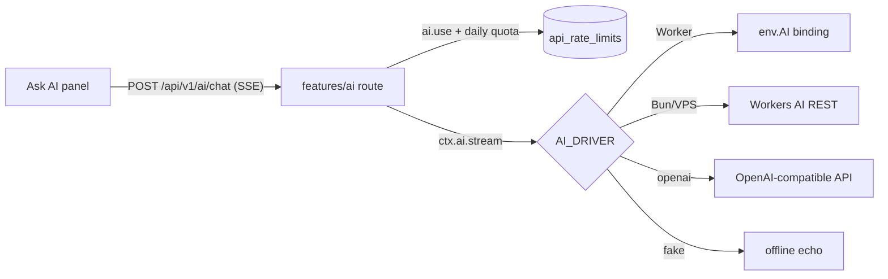

> Human-owned status: agents leave this at `in_progress`. Request (2026-10-08): an AI feature that is
> core (not opt-in), Cloudflare-native first, portable to a VPS, with a smooth UI, fit for a Workers
> Free demo. Use case: simple question and answer.

# F3.5 — Built-in AI assistant

## Flow

## Checkpoints

- [x] **F3.5.1** `ctx.ai` with `workers-ai` (binding or REST), `openai`, `fake`, `off` drivers and validated `AI_*` config
- [x] **F3.5.2** `GET /ai/status` and streaming `POST /ai/chat` behind `ai.use`, with a per-user daily limit
- [x] **F3.5.3** Web assistant panel: topbar button, ⌘/Ctrl+J, streaming answer, stop, retry, suggestions, mobile sheet
- [x] **F3.5.4** Cloudflare: `ai` binding in `wrangler.jsonc`, preflight requires it for `workers-ai`
- [x] **F3.5.5** Docs: `docs/ai.md`, ADR-0017, `.env.example`, README/AGENTS default-app rule

## Evidence

- red: F3.5.1 `bun test tests/unit/ai-drivers.test.ts` — Cannot find module '@/infra/ai/index.ts' (0 pass, 1 fail)
- green: F3.5.1 `bun test tests/unit/ai-drivers.test.ts` — 10 pass, 0 fail
- red: F3.5.2 `bun test tests/features/ai` — Cannot find module '@/infra/ai/index.ts' (0 pass, 1 fail)
- green: F3.5.2 `bun test tests/features/ai` — 8 pass, 0 fail (401/403/422/429/503, SSE delta+done, mid-stream error event)
- red: F3.5.3 `bun test tests/unit/assistant.test.tsx` — 0 pass, 1 fail (module not found)
- green: F3.5.3 `bun erp qa --only=core,assistant` — 20 checks, 0 failed, 0 API responses >= 400, 0 JS errors
- red: F3.5.4 `bun test tests/unit/cloudflare-preflight.test.ts` — 13 pass, 1 fail (missing "ai" binding not reported)
- green: F3.5.4 `bun test tests/unit/cloudflare-preflight.test.ts` — 14 pass, 0 fail
- red: F3.5.5 n/a — docs-only, nothing executable to fail
- green: F3.5.5 `bun erp check` — check: OK

Full suites (installed apps, disposable `erp_test_ai` database): server 560 pass / 0 fail, web 70 pass / 0
fail. Browser QA first found a real defect (the remaining-questions count only changed after a
refetch); the `done` event now updates it immediately, and the rerun passed. Screenshots: desktop,
mobile bottom sheet and dark theme reviewed.

Not run: a real Workers AI answer (needs the user's Cloudflare account: a Worker deploy, or
`AI_ACCOUNT_ID` + `AI_API_KEY` locally).
