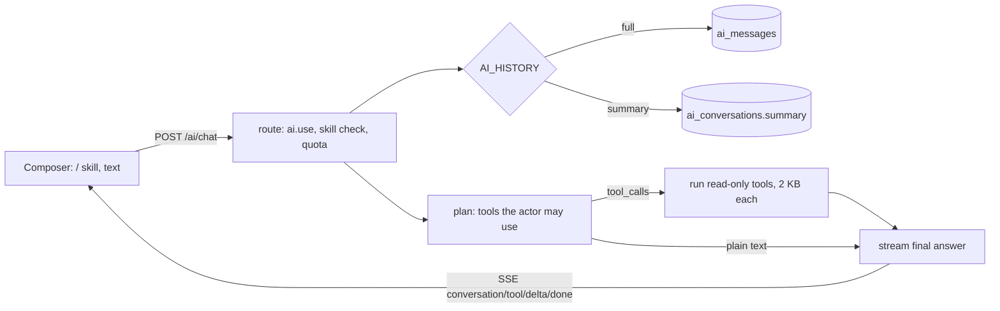

> Human-owned status: agents leave this at `in_progress`. Request (2026-10-08): focus on UX inside the
> normal ERP shell; history stored fully or only as a summary (configurable); skills; limited tools that
> still fit Cloudflare Workers Free (10 ms CPU, Workers AI Free 10k Neurons/day).

# F3.6 — AI assistant UX

## Flow

## Checkpoints

- [x] **F3.6.1** `AI_HISTORY`, `AI_TOOLS_ENABLED`, `AI_MAX_TOOL_CALLS`, `AI_TOOL_MODEL` validated; migration 0016 and conversation endpoints, self-scoped
- [x] **F3.6.2** Chat history: full, summary and off; server-loaded context; replaceFrom for regenerate and edit
- [x] **F3.6.3** Skill registry, `GET /ai/skills`, `skill` on chat (422 unknown, 403 forbidden)
- [x] **F3.6.4** Tool registry and planning for openai, Workers AI binding and REST, fake; limits and `tool` SSE event
- [x] **F3.6.5** Web: `/assistant` page, conversation list, composer with skill menu, rich text, message actions, tool cards, panel to full view
- [x] **F3.6.6** Browser QA suite extended; docs, ADR-0017 extension, `.env.example`

## Evidence

- red: F3.6.1 `bun test tests/unit/ai-tools.test.ts` — error: Cannot find module '@/features/ai/tools/execute.ts' (0 pass, 1 fail)
- green: F3.6.1 `bun test tests/unit/ai-tools.test.ts tests/features/ai tests/unit/ai-drivers.test.ts` — 53 pass, 0 fail
- red: F3.6.2 `bun test tests/features/ai` — 10 pass, 18 fail, 1 error (no conversations routes, no history)
- green: F3.6.2 `bun test tests/features/ai` — pass (included in 53 pass, 0 fail above)
- red: F3.6.3 `bun test tests/features/ai/ai-skills-tools.test.ts` — GET /ai/skills expected 200 (fail), skill prompt missing
- green: F3.6.3 `bun test tests/features/ai` — pass (53 pass, 0 fail)
- red: F3.6.4 `bun test tests/unit/ai-tools.test.ts` — Cannot find module (tool registry and plan() absent)
- green: F3.6.4 `bun test tests/unit/ai-tools.test.ts` — pass (53 pass, 0 fail)
- red: F3.6.5 `bun test tests/unit/assistant-ux.test.tsx` — Cannot find module conversation-list.tsx (0 pass, 1 fail)
- green: F3.6.5 `bun test tests/unit/assistant-ux.test.tsx tests/unit/assistant.test.tsx` — 15 pass, 0 fail
- red: F3.6.6 n/a — the first QA run found a real defect (a check counted turns twice while the sheet animated out; the skill menu spanned the full column width, fixed)
- green: F3.6.6 `bun erp qa --only=core,assistant` — 33 checks, 0 failed, 0 API responses >= 400, 0 JS errors

Not run: real Workers AI function calling (needs a Cloudflare account); the Hermes default tool model is
taken from the Workers AI docs, not exercised live.
